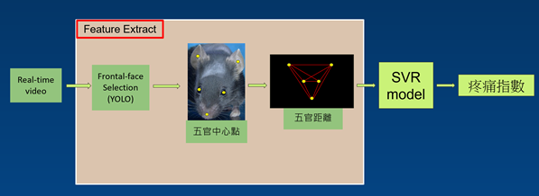
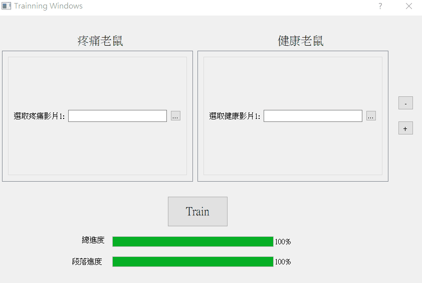
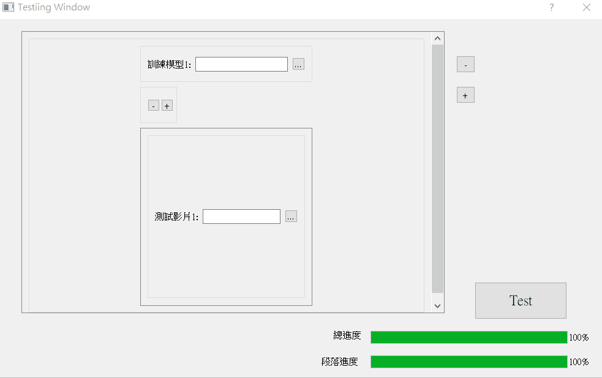

# Mice-pain-regression-yolo tool
Pain analysis system of mice, it can train the classification model by selected videos then use the output model to test on the others selected videos.

## Structure



* Based on the paper https://hdl.handle.net/11296/a55786
  - Replaced the Mask-RCNN part with YOLOv5 to detect landmarks

## Features

* Train models
  * Input : positive labeled video and negative labeled video
  * Batch of models training
* Inference
  * Input : video to detect
  * Batch of videos and can select different models
* Visualizing the current progress
  * Yolo detection and SVR training will takes long times

## Installation

```Shell
pip install -r requirements.txt
```

* Install pytorch (torch==1.6.0+cu101, torchvision==0.7.0+cu101) manually from the official website

## Run

```Shell
python start.py
```

## Operation instruction

* Training



* Inference (Testing)



## Reference

[yolov5](https://github.com/ultralytics/yolov5)
