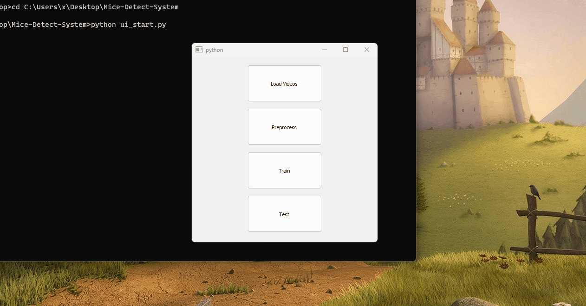
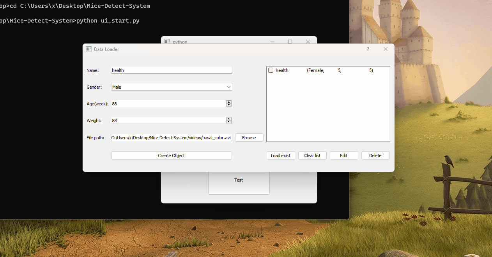
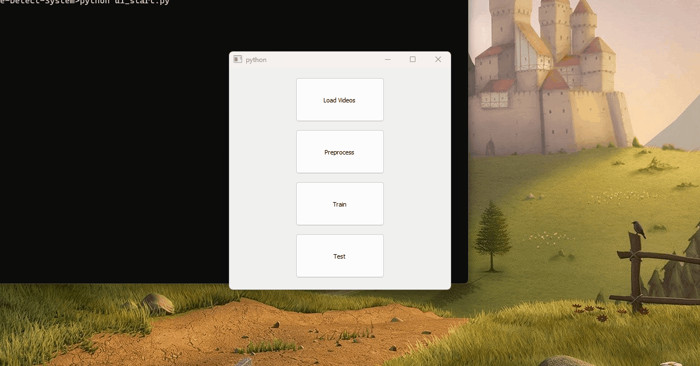
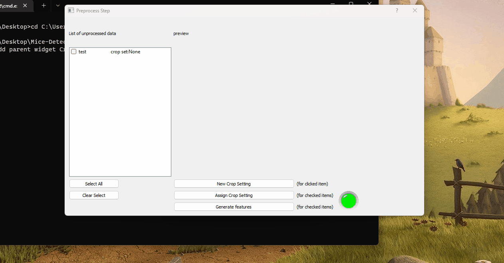
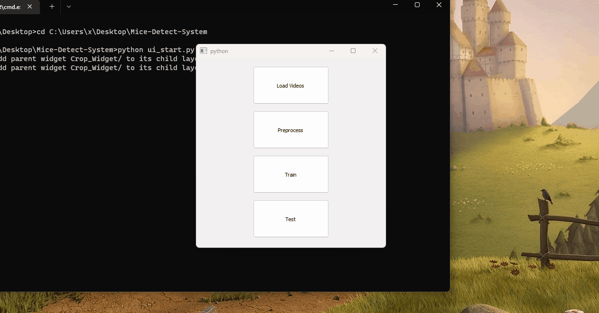
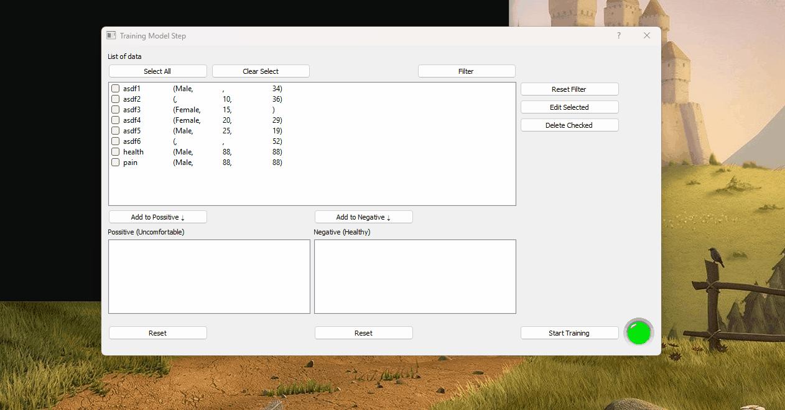
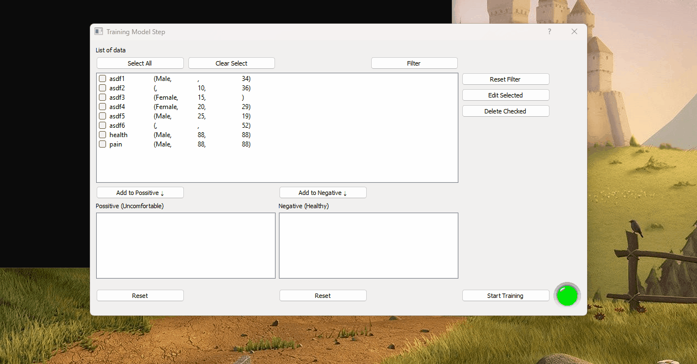
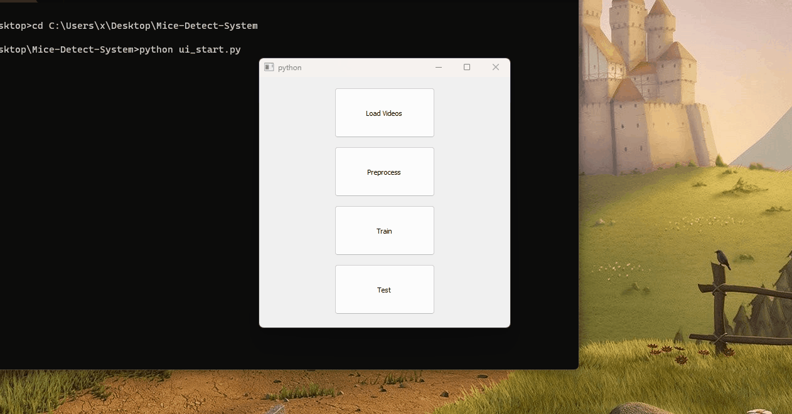
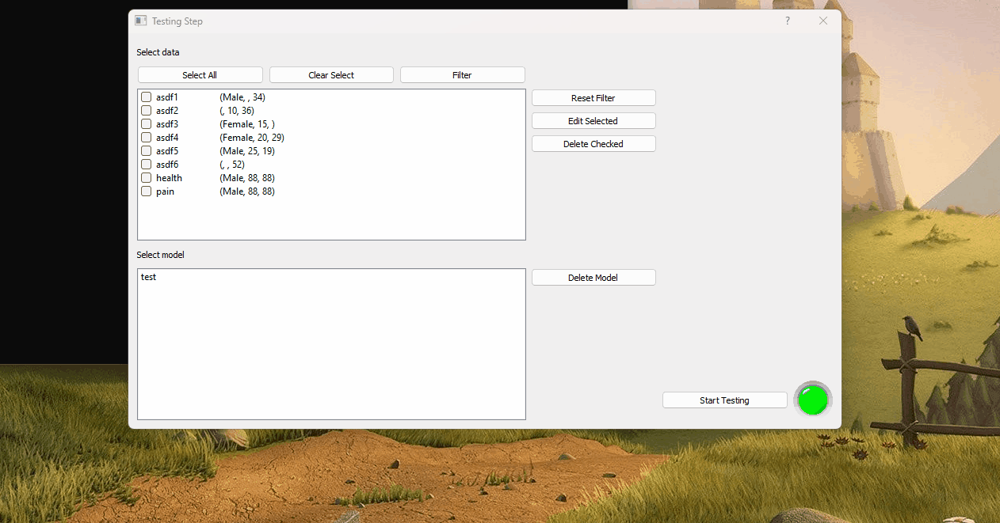

# Mice-Detect-System
An application to detect mice status and record the results and models of different individuals.

## Features

* Data Load : load video files and manage it on database
* Feature Process : crop region setup and generate features
* Train : manage the processed data and select data to train model
* Test : manage the processed data, models and select data to test model

## Demo

* create data

* delete data

* edit data

* Assign crop setup and generate features

* create crop setup

* train model (with validation)

* train data management-delete

* train data management-edit

* train data management-filter

* test model on data

* test-delete model

## Reference

my thesis work : https://github.com/superhoan/final
